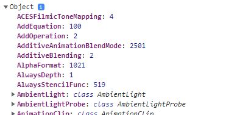
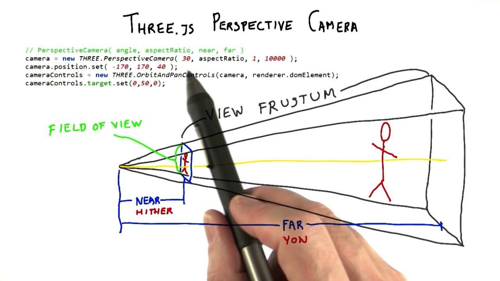

## Why and how to use threeJs to create beautiful creative website?
### Our goal

1. ThreeJs is a library of 3d models. It controls the model files with ext () and creates a 3d visual view on the website. <br>
2. The url of the orginal lib: https://threejs.org/ | for React: https://github.com/pmndrs/react-three-fiber | for Vue: https://github.com/troisjs/trois <br>
3. Its used WEBGL to draw into the canvas tag <br>
4.  

### First step

- We can `console.log(THREE)` variable to log what global THREE does. It a object of collection of all the features & attributes.

```javascript
console.log(THREE)
```

<br/>

### Get start with elements

- To run a simple app, we need to care for `4 elements` subjects:

| Elements            |                                                                                                                                            |
| --------------------| :------------------------------------------------------------------------------------------------------------------------------------------|
| 1. A scene that will contain objects | Scene là 1 hình thái bao gồm ánh sáng, các đối tượng, các model chứa trong đó                                             |
| 2. Some objects     | Object có thể là 1 hình học được vẽ ra(primitive geometries), các model được import vào, các vật rất nhỏ (particles), ánh sáng đặc biệt,.. |
| 3. A camera         | Camera là điểm nhìn từ mắt tới vật thể                                                                                                     |
| 4. A renderer       | Renderer là bước cuối để hiển thị scene                                                                                                    |

1. A scene that will contain objects: Scene là 1 hình thái bao gồm ánh sáng, các đối tượng, các model chứa trong đó

```javascript
const SCENE = new THREE.Scene()
```

2. Some objects: Object có thể là 1 hình học được vẽ ra(primitive geometries), các model được import vào, các vật rất nhỏ (particles), ánh sáng đặc biệt,.. 

- `Object 3d` (by code - not import) normally created name `Mesh`, combination of 2 things: `geometry (the shape)` & `material (how it looks - a skin)` <br>
- `Mesh`: https://threejs.org/docs/index.html?q=mesh#api/en/objects/Mesh <br>

```javascript
const geometry = new THREE.BoxGeometry( 1, 1, 1 );
const material = new THREE.MeshBasicMaterial( { color: 0xffff00 } );
const mesh = new THREE.Mesh( geometry, material );
scene.add( mesh );
```

- `Geometry`: gồm các API khác nhau để tạo được các hình dạng khác nhau của vật thể <br>
- `BoxGeometry`: https://threejs.org/docs/index.html#api/en/geometries/BoxGeometry <br>
- BoxGeometry là API tạo ra 1 box hình lập phương, truyền vào 3 tham số tương ứng với 3 trục `x, y, z` <br>

```javascript
const geometry = new THREE.BoxGeometry( 1, 1, 1 );
```

- `Material`: gồm các API khác nhau để tạo ra chất liệu của vật thể <br>
- https://threejs.org/docs/index.html#api/en/materials/LineBasicMaterial <br>

```javascript
const material = new THREE.MeshBasicMaterial( { color: 0xffff00 } );
```

3. A camera

- https://threejs.org/docs/index.html#api/en/cameras/PerspectiveCamera <br>
- Có 3-4 loại camera API được tạo ra nhằm phục vụ nhiều mục đích khác nhau <br>
- `PerspectiveCamera`: là 1 API sử dụng góc camera thông dụng nhất để view các object hiển thị trên scene <br>
- Có thể sử dụng nhiều loại camera cùng 1 lúc để thể hiện các góc độ khác nhau <br>

<br/>

- `camera.position.*` chúng ta cần quan tâm tới vị trí của camera <br>
- `Quick tip`: để xác định vị trí trong tọa độ camera, chúng ta có thể sử dụng ảnh sau <br>

<br/>

```javascript
const size = {
	width: 800,
	height: 600
}
const camera = new THREE.PerspectiveCamera( 45, size.width / size.height );
scene.add( camera );
```

4. A renderer

- ThreeJs sử dụng `WEBGL` để render ra object thông qua thẻ `canvas` hoặc render trực tiếp qua `body` <br>

```javascript
// Select the canvas
const canvas = document.getElementById('webgl'); // document.body.appendChild( renderer.domElement );

// Rerender
const renderer = new THREE.WebGLRenderer({
	canvas: canvas
});
renderer.setSize( size.width, size.height ); // window.innerWidth, window.innerHeight
renderer.render(SCENE, camera);
```
