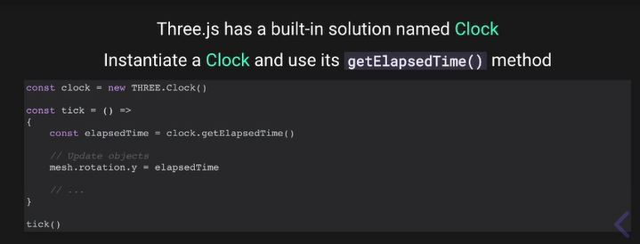

## An animation
### Our goal

- The reality of the animation of an object is a screenshot of the scene each second (fps). Average animate of object run in 60 frames per second (60fps) <br> 
- Purpose `window.requestAnimationFrame(callback)` is calling func provided on the next frame <br>
- The problem is `requestAnimationFrame` run with correct frame rate of monitor(60hz, 75hz, 120hz, 144hz,..) so in some case, if you not caculator, the spin or rotate maybe fater than default. <br>

1. Use `window.requestAnimationFrame(callback)` for each fps, purpose is calling func provided on the next frame.

```javascript
// https://vuilaptrinh.com/2019-05-24-gioi-thieu-ve-request-animation/

const animate = () => {
	requestAnimationFrame( animate ); 
	mesh.rotation.x += 0.01;
	mesh.rotation.y += 0.01;

	renderer.render(SCENE, camera);
}
animate();
```

2. The problem is `requestAnimationFrame` => FIX: we can lean on the timer

```javascript
let time = Date.now()

const animate = () => {
	const currentTime = Date.now();
	const deltaTime = currentTime - time;
	time = currentTime;

	mesh.rotation.x += 0.01 * deltaTime;
	mesh.rotation.y += 0.01 * deltaTime;

	requestAnimationFrame(animate); 
	renderer.render(SCENE, camera);
}
animate();

```

<br/>

3. We can use the `Math of Sin|Cos|Tan` to caculator the moving of objects.

```javascript
mesh.position.x += Math.sin(...);
mesh.position.y +=  Math.cos(...);
```
