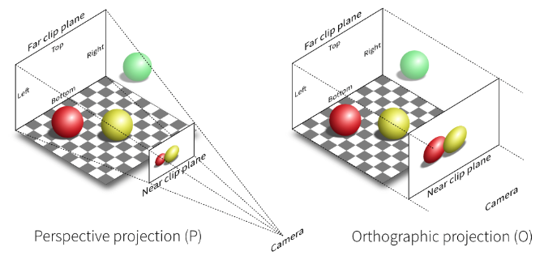
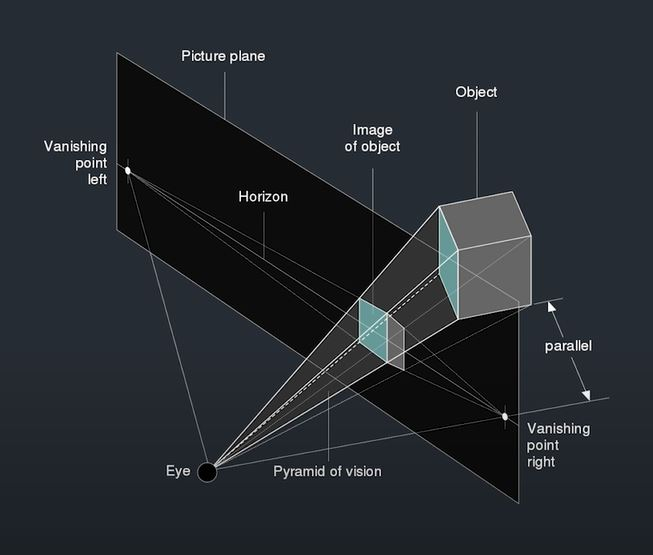
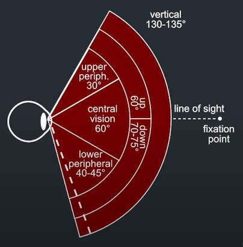
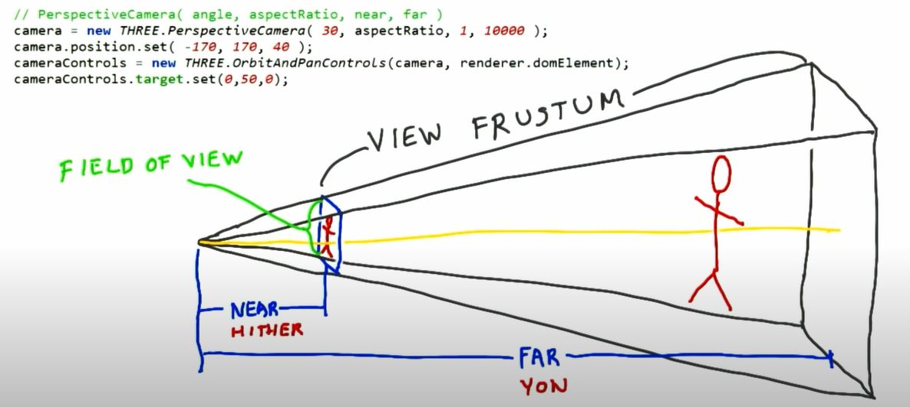

## Cameras

### Our goal

<br/>

<br/>

- https://threejs.org/docs/#api/en/cameras/PerspectiveCamera <br>
- https://threejs.org/docs/#api/en/cameras/OrthographicCamera <br>

### Get start with cameras

| Cameras               |                                                                                                                                                        |
| --------------------- | :----------------------------------------------------------------------------------------------------------------------------------------------------- |
| 1. Array Camera       | Là dạng multiple camera, giống việc chơi game đua xe nhưng với các góc nhìn khác nhau                                                                  |
| 2. Stereo Camera      | Là dạng camera có 2 góc nhìn giống mắt người, taojra scence có góc nhìn rộng hơn 1 camera , sử dụng dạng VR headset, red & blue glasses hoặc cardboard |
| 3. Cube Camera        | Là dạng camera render nhiều góc độ của vật thể, áp dụng trong maps, ...                                                                                |
| 4. OrthographicCamera | Là dạng camera nhìn theo chiều 2D (khoảng cách của các vật sẽ ít được thể hiện rõ như loại 3d)                                                         |
| 5. PerspectiveCamera  | Là dạng camera nhìn 3d                                                                                                                                 |

1. `Perspective Camera`

```javascript
// Camera
const camera = new THREE.PerspectiveCamera(45, width / height, 1, 1000);
scene.add(camera);

// PerspectiveCamera( fov : Number, aspect : Number, near : Number, far : Number )
// fov — Camera frustum vertical field of view.
// aspect — Camera frustum aspect ratio.
// near — Camera frustum near plane.
// far — Camera frustum far plane.
```

- Giá trị `45` là góc độ (Field of view === fov), fov càng lớn thì tầm nhìn càng lớn => object càng nhỏ <br>

 <br>

 <br>

- Giá trị `aspect` là tỷ lệ w/h của scence hiển thị, nó sẽ ảnh hưởng đến kích thước của object nếu tỷ lệ thay đổi <br>
- 
