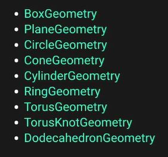

## Geometries

### Our goal

- `Mesh` được tạo nên từ `Material (Chất liệu)` + `Geometries (Object vật thể)` <br>

```javascript
const geometry = new THREE.BoxGeometry(1, 1, 1);
const material = new THREE.MeshBasicMaterial({ color: 0xffff00 });
const mesh = new THREE.Mesh(geometry, material);
scene.add(mesh);
```

- `Geometries` tạo ra các object lập phương, tam giác với các mảng ghép lại với nhau - `face` - (rỗng ở trong) <br>
- https://threejs.org/docs/#api/en/geometries/BoxGeometry <br>
- Chúng ta có rất nhiều các build-in để tạo các hình khối geometries khác nhau <br>

<br/>
